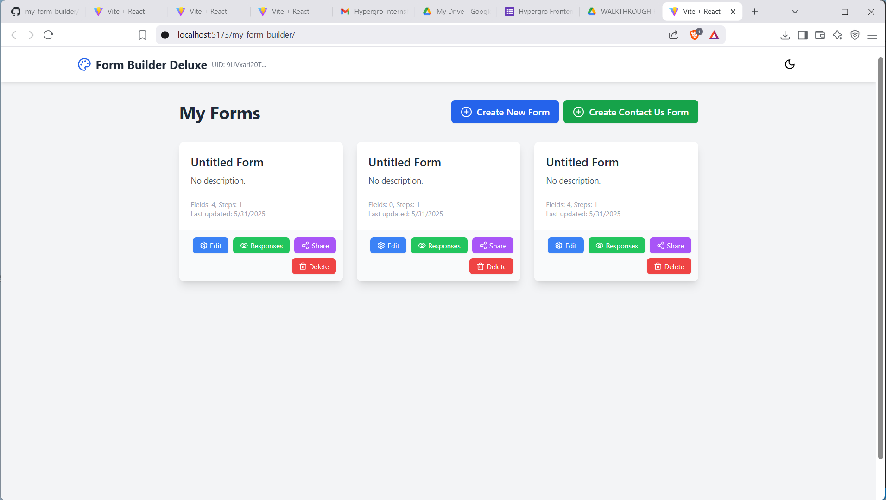

# Form Builder Deluxe

A modern, responsive form builder built with React, Zustand, and DnD Kit. Easily create, preview, and share custom forms with drag-and-drop functionality.

[Live Demo](https://aashish13jan.github.io/my-form-builder/)

---

## Features

- Drag-and-drop form builder (desktop & mobile)
- Responsive design for all devices
- Light/Dark mode toggle
- Preview forms on mobile, tablet, and desktop
- Save and share forms with unique links
- View form responses

---

## Getting Started

### Installation

```sh
git clone https://github.com/your-username/your-repo.git
cd your-repo
npm install
```

### Development

```sh
npm run dev
```

### Build & Deploy

```sh
npm run build
npm run deploy
```

---

## Technologies Used

- [React](https://react.dev/)
- [Vite](https://vitejs.dev/)
- [DnD Kit](https://dndkit.com/)
- [Zustand](https://zustand-demo.pmnd.rs/)
- [Tailwind CSS](https://tailwindcss.com/)

---

## Demo

[Live Site](https://aashish13jan.github.io/my-form-builder/)

---

## Screenshots



<!-- Add more screenshots here if you have them -->

---

## License

MIT

---

## Author

Aashish13jan
